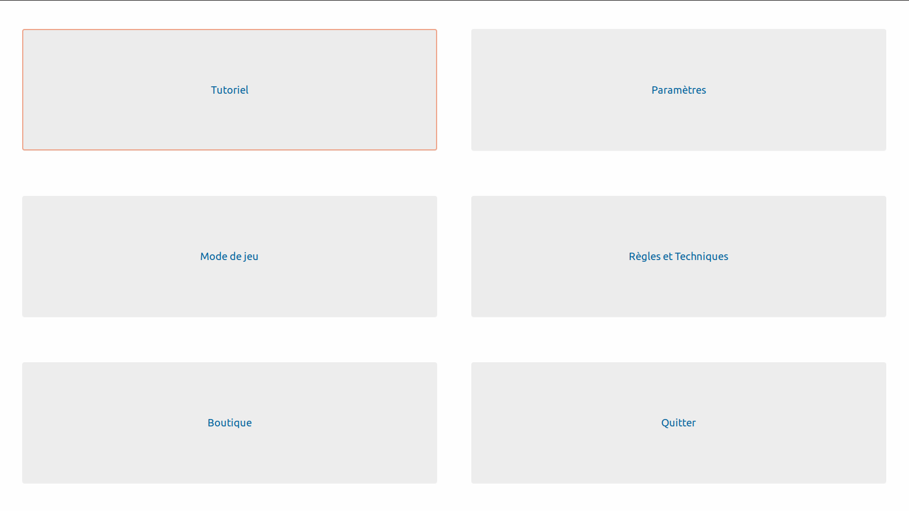
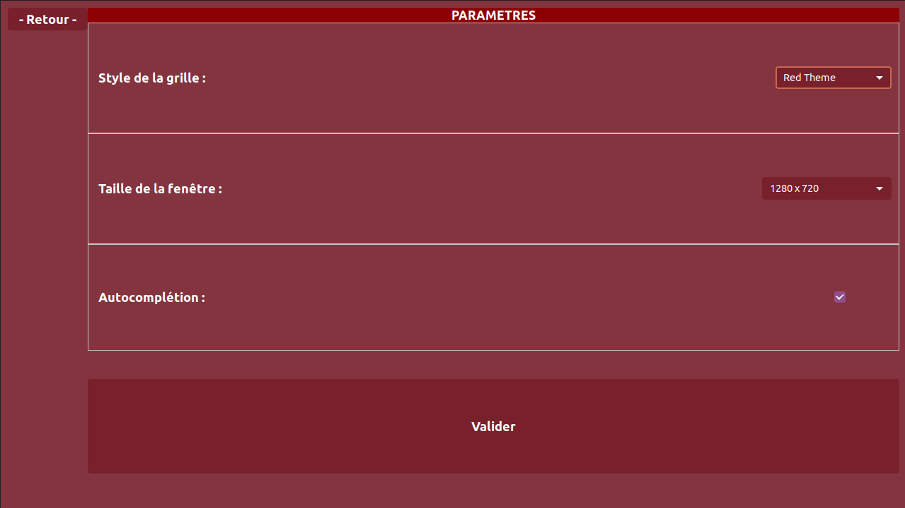
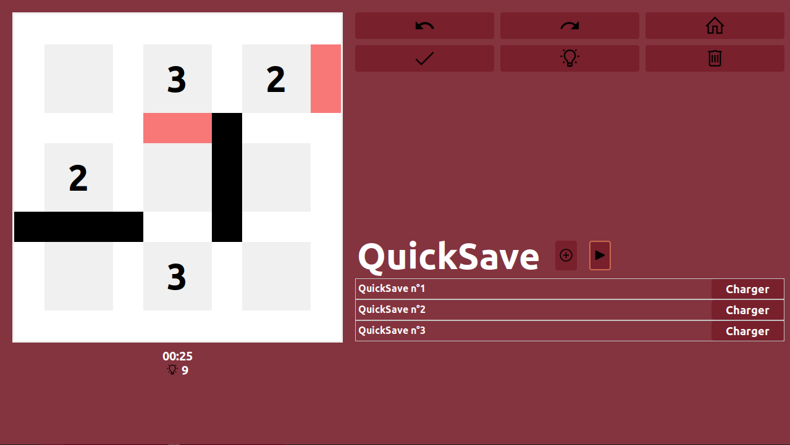

# SlitherLink

## Install & play

To install, run  
sudo ./install  
Then you can launch the SlitherLink with the command  
./SlitherLink  

## SlitherLink

the game was taken from the official concept :  
https://www.conceptispuzzles.com/index.aspx?uri=puzzle/slitherlink/

It has been made with the ruby language and the GTK graphics library.

made by Mathis Despres, Tibane Galbrun, Benjamin Rondeau, Eric Tan, Mathieu Vaudeleau

  
  
  
